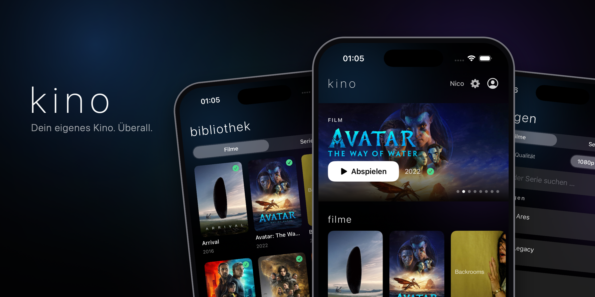
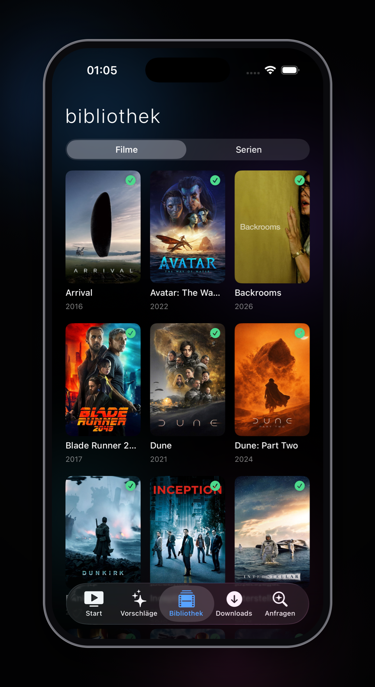
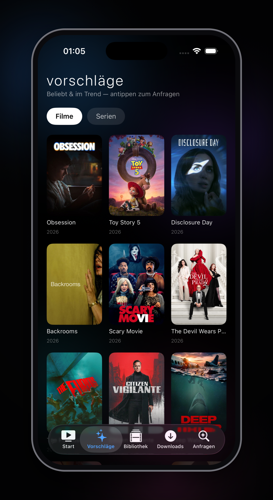
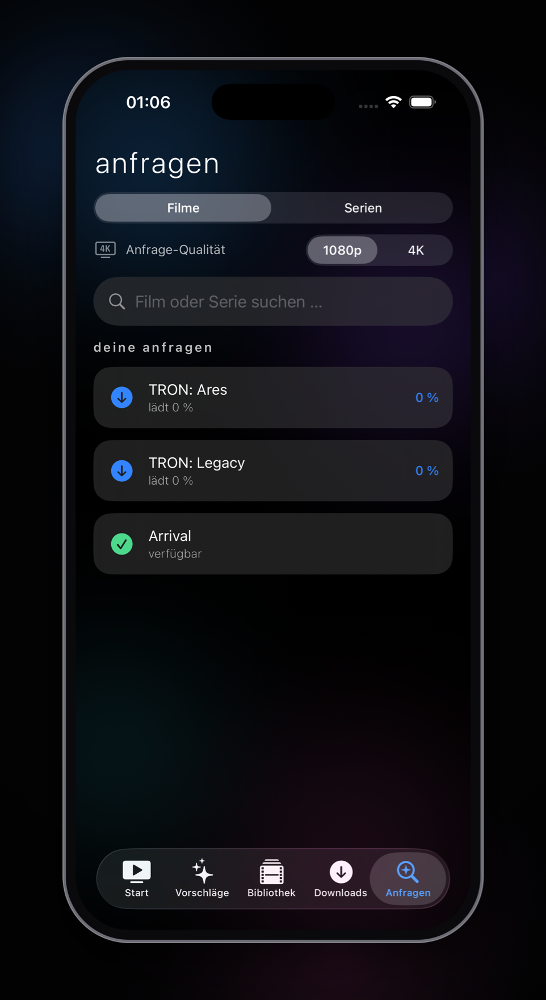

# Kino

Mein eigenes kleines Kino fürs iPhone. Zuhause läuft ein Jellyfin-Server mit meiner
Film- und Serien-Sammlung – Kino ist die App davor: aufmachen, Poster durchscrollen,
antippen, läuft. Kein Netflix-Menü-Dschungel, kein „in deinem Land nicht verfügbar“.
Nur meine Bibliothek, in der Optik, die ich mag.

Die Optik heißt **Kinekt**: tiefes Schwarz, ein weicher farbiger Glow im Hintergrund,
die Schrift dünn und weit gesperrt. Ruhig und ein bisschen wie aus dem Off – daran
erkennt man alles, was zu meinem Setup gehört.

<p align="center">
  
</p>

<p align="center">
  
  
  
</p>

## Was die App kann

- **Start** – ein rotierender Aufmacher, „Weiter ansehen“, Favoriten und dann die
  Bibliothek nach Filmen, Serien und Genres sortiert. Der Fortschritt merkt sich pro
  Profil, wo ich stehengeblieben bin.
- **Bibliothek** – das komplette Regal als Poster-Raster, umschaltbar zwischen Filmen
  und Serien. Poster kommen in der passenden Größe vom Server, nicht als
  Riesen-Originale – deshalb baut sich das Raster sofort auf.
- **Player** – nativer Videoplayer mit Untertiteln, Tonspuren, AirPlay und PiP. Vor dem
  Abspielen wähle ich pro Titel **gute Qualität** (Original, nichts wird neu kodiert)
  oder **datensparend** (komprimiert fürs Handynetz). Wo ich war, wird gespeichert.
- **Downloads** – ein Klick, und der Titel wird zuhause auf einem Rechner mit GPU klein
  gerechnet und danach automatisch aufs Gerät geladen. Gut für Flüge und U-Bahn.
- **Vorschläge & Anfragen** – was gerade beliebt/im Trend ist, und die Suche: fehlt ein
  Film, wird er per Antippen angefragt und landet später von selbst in der Bibliothek.

## Anmelden

Kein Passwort-Feld. Der Ablauf:

1. **2FA-Code** anfragen – der Code kommt per Telegram auf mein Handy und schaltet das
   Gerät frei.
2. **User-Code** eingeben – der persönliche Code entscheidet, welche Profile jemand
   überhaupt sieht. Wer nur sein eigenes Profil freigeschaltet hat, sieht auch nur das.
3. **Profil wählen** – fertig. Keine extra PIN, weil der User-Code schon regelt, was
   sichtbar ist.

Welche Codes welche Profile freischalten, entscheidet der Server (per Umgebungsvariable),
nicht die App. So kann ich Zugänge ändern, ohne eine neue Version zu bauen.

## Wie es gebaut ist

- **App:** SwiftUI, ein AVPlayer für die Wiedergabe, XcodeGen fürs Projekt. Kein
  Storyboard, kein Fremd-SDK.
- **Backend:** ein schlankes FastAPI-Backend (Teil von „Kinekt“), das vor Jellyfin sitzt
  und die App-Endpunkte liefert – Bibliothek, Streaming-URLs, Poster, Login, Downloads.
  Erreichbar nur übers eigene Tailnet (Tailscale), nicht offen im Netz.
- **Server:** Jellyfin + das Arr-Gespann (Radarr/Sonarr/Prowlarr/qBittorrent) auf einem
  Homeserver.

## Selbst bauen

```bash
brew install xcodegen
cd kino
xcodegen generate
open Kino.xcodeproj
```

In `kino/project.yml` das eigene `DEVELOPMENT_TEAM` eintragen. Aufs Gerät kommt die App bei
mir per Sideload (SideStore) als `.ipa` – dafür reicht ein Debug- oder unsigniertes
Release-Build, signiert wird beim Installieren.
