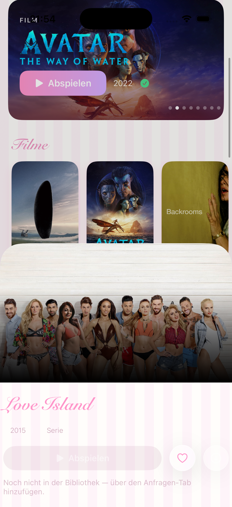
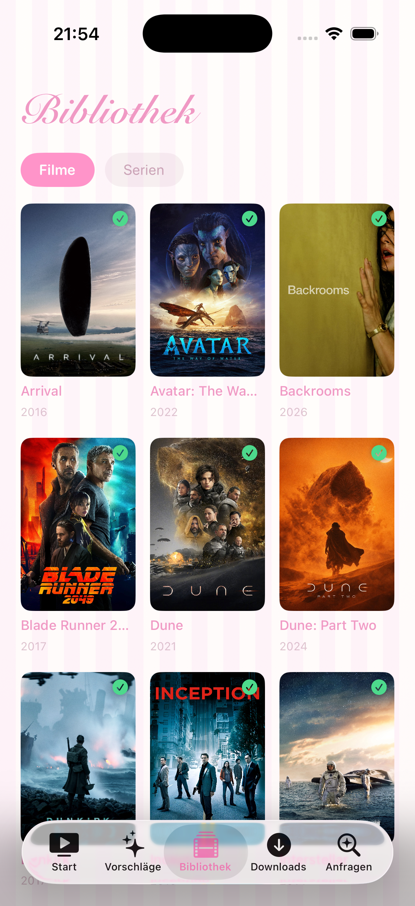
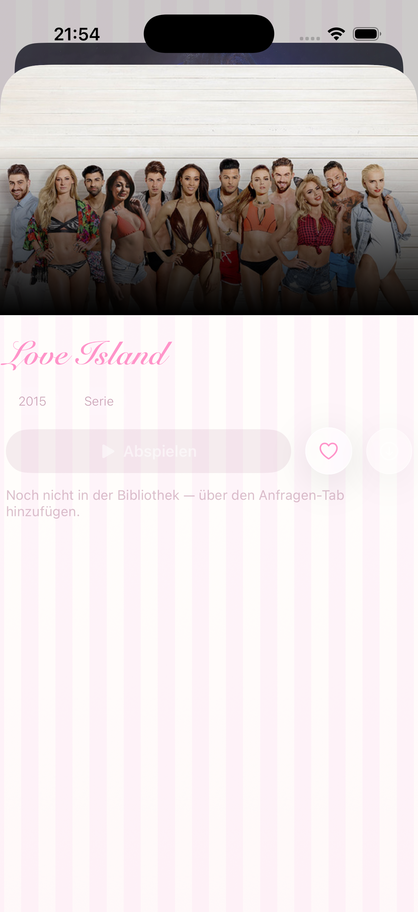

<div align="center">

# 🎬 Kino

**Ein privater, Netflix-artiger Media-Player für iPhone, iPad & Mac.**

Eigene Bibliothek · 1080p-Streaming · kugelsichere Offline-Downloads · Vorschläge & Anfragen ·
pro-Profil-Themes — von cleanem Apple-TV-Look bis pastelligem Brandy-Melville-Vibe.

<br/>


&nbsp;

&nbsp;


<sub>Das pastellige „Brandy Melville"-Theme (eines von zwei Profil-Looks)</sub>

</div>

---

## Inhalt

- [Was ist Kino?](#was-ist-kino)
- [Installieren](#-installieren)
- [Features](#-features)
- [Login & Sicherheit](#-login--sicherheit)
- [Wie es funktioniert (Architektur)](#-wie-es-funktioniert-architektur)
- [Aus dem Quellcode bauen](#-aus-dem-quellcode-bauen)
- [Projektstruktur](#-projektstruktur)
- [Tech-Stack](#-tech-stack)

---

## Was ist Kino?

Kino ist die iOS-/iPadOS-/macOS-App zu einem **selbst gehosteten Heim-Medienserver**
(Jellyfin + *Arr-Stack). Sie sieht aus und fühlt sich an wie eine kommerzielle Streaming-App —
nur dass die Bibliothek deine eigene ist und die App **ausschließlich Medien** darf (kein
Server-Zugriff, siehe [Sicherheit](#-login--sicherheit)).

Gebaut wurde sie als **persönliche App für zwei Nutzer**, die sich ein Server teilen. Deshalb
kann jedes Profil ein **eigenes Theme** haben:

| Profil-Look | Beschreibung |
|---|---|
| **Apple-TV** | tiefes Schwarz, klares Blau, kräftige Typo — das Artwork trägt die Farbe |
| **Brandy Melville** | helle Candy-Stripes, pastelliges Rosé, geschwungene Script-Schrift, weiche Schatten — coquette/„soft girl" |

Das Theme ist an das Profil gekoppelt: derselbe App-Build, zwei komplett verschiedene Welten.

---

## 📥 Installieren

### iPhone / iPad — über SideStore (ohne App Store, ohne Kabel)

1. **SideStore** einmalig einrichten → https://sidestore.io
2. In SideStore **Sources → + →** diese URL einfügen:
   ```
   https://raw.githubusercontent.com/nicolasjankovich-netizen/kino/main/source/apps.json
   ```
3. **Kino** erscheint → **Get** → installiert. Danach **automatische Updates über WLAN**.

*Alternativ:* die fertige [`install/Kino.ipa`](install/Kino.ipa) direkt in SideStore laden,
oder das jeweils neueste [Release](../../releases).

### Mac

Als Mac-App aus dem Quellcode bauen (Mac Catalyst) — siehe [Aus dem Quellcode bauen](#-aus-dem-quellcode-bauen).

---

## ✨ Features

### Ansehen
- **Startseite im Apple-TV-Stil** — rotierende Hero-Banner mit dem **echten Titel-Schriftzug vom
  Cover** (TMDB *clearlogo*, wie bei JellyTV), plus Reihen für Weiterschauen, Favoriten, Filme,
  Serien und automatische **Genre-Kategorien**.
- **1080p-Streaming** mit sauberem **Stereo-Ton** (adaptives HLS-Transcoding, Untertitel, PiP,
  Resume/„Weiterschauen" pro Profil).
- **Detailseite** im JellyTV-Stil: Bewertung, Handlung, Laufzeit, **Besetzung** und
  **„Ähnliche Titel"** (aus TMDB/Jellyseerr) — Ähnliche direkt anfragbar.

### Offline — „bulletproof"
- **Ein-Klick-Download** eines Films → er wird auf einem Encoder-PC (NVENC) zu einer kleinen
  **720p-HEVC**-Datei in guter Qualität komprimiert und lädt automatisch aufs Gerät.
- **Kugelsicher gebaut:** Hintergrund-Download (läuft weiter, wenn die App zu ist), **Resume**
  bei Verbindungsabbruch, bis zu **6× Auto-Retry**, korrekter Fortschritt nach App-Neustart oder
  WLAN↔Mobilfunk-Wechsel. Fertige Downloads bleiben erhalten; die Server-Version bleibt liegen,
  sodass ein erneuter Download **sofort** da ist.
- **Live Activity** auf dem Sperrbildschirm / in der Dynamic Island während Kompression & Download.

### Entdecken & Anfragen
- **Vorschläge** — beliebte & trendende Titel (Jellyseerr/TMDB), antippen zum Anfragen.
- **Suche & Anfrage** — fehlt ein Film/eine Serie? Anfragen → der Server lädt ihn automatisch
  herunter und er erscheint danach in der Bibliothek.
- **Auto-Prep:** Für ein Profil kann eingestellt sein, dass **jeder angefragte Film automatisch**
  in die kleine Offline-Version komprimiert wird — ohne einen einzigen weiteren Handgriff.

### Plattform
- **iPhone · iPad · Mac** aus **einer** SwiftUI-Codebasis (Mac Catalyst), adaptives Layout.
- **Home-Screen-Widget** + Live Activities (WidgetKit).

---

## 🔐 Login & Sicherheit

Kino ist **öffentlich einsehbar (dieser Code), aber sicher gebaut** — die App kann prinzipiell
nur Medien:

- **Media-scoped Token:** Nach dem Login besitzt die App ein Token, das **ausschließlich** die
  `/api/media/*`-Endpunkte öffnet. Server-Administration, Dateisystem, System-Einstellungen sind
  serverseitig **geblockt** (jeder Nicht-Medien-Endpunkt antwortet der App mit `401`).
- **Kein Geheimnis im Code:** Die App enthält **keinen** Admin-Token. Erst nach dem Login liegt
  das scoped Token **verschlüsselt im Keychain**.
- **Key-Login:** Anmeldung per Einmal-Key (wird dem Besitzer per Telegram zugestellt) — danach
  bleibt das Gerät angemeldet (stressfrei, auch offline). Rate-Limit gegen Brute-Force.
- Der Server ist über eine feste Tailnet-Funnel-Adresse erreichbar (kein VPN nötig); **jeder**
  Zugriff ist login- und scope-geprüft.

> Dieses Repo enthält **nur die App**. Server-Code, Tokens und Schlüssel liegen in einem
> **privaten** Repository und sind hier bewusst nicht enthalten.

---

## 🏗 Wie es funktioniert (Architektur)

```
┌──────────────┐   HLS 1080p / MP4 720p    ┌───────────────────────────────┐
│   Kino-App   │ ◀───────────────────────▶ │  Backend (FastAPI, Tailnet)   │
│  (SwiftUI)   │   media-scoped Token      │  /api/media/*  · media-auth   │
└──────────────┘                           └───────────────┬───────────────┘
       ▲                                                    │
       │ Titel-Logos (TMDB)                                 ▼
       │                            ┌──────────┬──────────┬──────────┬───────────┐
       │                            │ Jellyfin │  Radarr  │  Sonarr  │ Jellyseerr│
       └────────────────────────────┤ (Stream) │ (Filme)  │ (Serien) │ (Discover)│
                                    └──────────┴──────────┴─────┬────┴───────────┘
                                                                │ „für den Flug"
                                                                ▼
                                                     ┌─────────────────────┐
                                                     │  Encoder-PC (NVENC) │
                                                     │  720p HEVC, klein   │
                                                     └─────────────────────┘
```

- **Streaming:** Das Backend fragt Jellyfin `PlaybackInfo` an und liefert eine transcodierte,
  AVPlayer-taugliche **HLS-URL** (h264/aac, auf 2 Audiokanäle begrenzt → iOS spielt zuverlässig
  Ton).
- **Titel-Logos:** Aus TMDB `/images` (bestes englisches PNG) — für den JellyTV-Hero-Look.
- **Offline:** Ein Encoder-PC komprimiert Filme mit **NVENC** zu 720p-HEVC-Stereo und legt sie
  bereit; die App lädt sie im Hintergrund.
- **Anfragen:** gehen an Radarr/Sonarr; **Vorschläge** kommen aus Jellyseerr/TMDB.

---

## 🔧 Aus dem Quellcode bauen

Das Xcode-Projekt wird mit **[XcodeGen](https://github.com/yonaskolb/XcodeGen)** aus
[`kino/project.yml`](kino/project.yml) erzeugt (kein `.xcodeproj` im Repo).

```bash
brew install xcodegen
cd kino
xcodegen generate          # erzeugt Kino.xcodeproj
open Kino.xcodeproj
```

- **Ziel:** iOS 26 (iPhone/iPad) + Mac Catalyst.
- In den Signing-Einstellungen dein eigenes Team wählen.
- `let backendBase` in [`Sources/App.swift`](kino/Sources/App.swift) auf deinen Server zeigen lassen.
- `.ipa` für SideStore (unsigniert — SideStore signiert selbst):
  ```bash
  xcodebuild -scheme Kino -configuration Release -destination 'generic/platform=iOS' \
    -derivedDataPath build CODE_SIGNING_ALLOWED=NO build
  cd build/Build/Products/Release-iphoneos && mkdir Payload && cp -R Kino.app Payload/ \
    && zip -r Kino.ipa Payload
  ```

---

## 📁 Projektstruktur

```
kino/
├─ Sources/            SwiftUI-App
│  ├─ App.swift        Einstieg, Theme-System (girlie/apple-tv), API-Client (Cinema)
│  ├─ Accounts.swift   Profile, Key-Login, Keychain, Watch-State pro Profil
│  ├─ HomeView.swift   Startseite: Hero (Titel-Logo), Reihen, Detailseite
│  ├─ Downloads*.swift kugelsicherer Hintergrund-Download-Manager + Download-Tab
│  ├─ DiscoverView     Bibliothek (Poster-Grid)
│  ├─ SuggestionsView  Vorschläge (Jellyseerr/TMDB)
│  ├─ SearchView       Suchen & Anfragen
│  ├─ PlayerView       AVPlayer/HLS mit Untertiteln, PiP, Resume
│  └─ CachedImage      In-Memory-/Disk-Poster-Cache
├─ Shared/             Live-Activity-Attributes (App + Widget)
├─ Widgets/            WidgetKit-Extension
├─ Assets.xcassets/    App-Icon
└─ project.yml         XcodeGen-Definition
install/Kino.ipa       fertige, per SideStore installierbare App
source/apps.json       SideStore-Source (Auto-Updates)
screenshots/           Screenshots fürs README/den Store
```

---

## 🧰 Tech-Stack

**App:** SwiftUI · WidgetKit / Live Activities · AVKit (HLS) · Background `URLSession` · Keychain ·
Mac Catalyst · [XcodeGen](https://github.com/yonaskolb/XcodeGen)

**Backend (privat):** FastAPI · Jellyfin · Radarr / Sonarr / Prowlarr · Jellyseerr · TMDB ·
Tailscale (Funnel) · NVENC-Encoder-PC

---

<div align="center"><sub>🤖 Gebaut mit <a href="https://claude.com/claude-code">Claude Code</a></sub></div>
